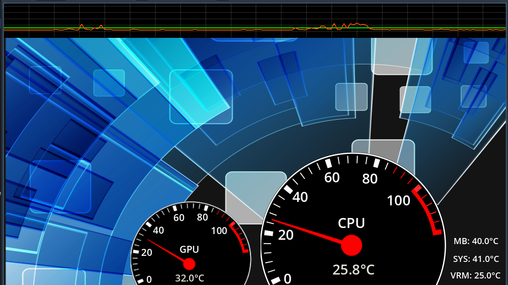

# Godot C++ Sensors Demo

This project uses **Godot C++ (GDExtension)** for native code integration.

## About

Godot C++ (previously known as GDNative) allows you to write high-performance game logic and systems using C++ while leveraging the Godot Engine.

## Requirements

- Godot Engine 4.x
- Godot C++ bindings (GDExtension)
- A compatible C++ compiler (e.g., GCC, Clang, or MSVC)

## Build

Follow the official [Godot C++ documentation](https://docs.godotengine.org/en/stable/tutorials/scripting/gdextension/index.html) to set up and build your extension.

How to setup Godot-cpp, GD extensions in Godot 4.5 
https://www.linkedin.com/pulse/copy-how-setup-godot-cpp-gd-extensions-godot-45-gustav-coetzee-4uc7f?utm_source=share&utm_medium=member_android&utm_campaign=share_via
